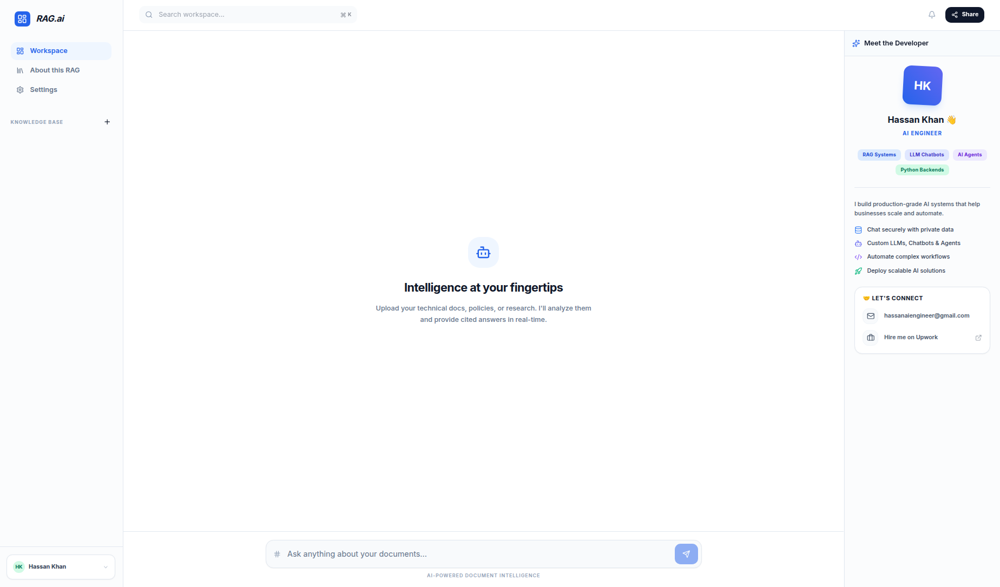

<div align="center">

# 🧠 RAG.ai — Document Intelligence Engine

### Agentic RAG · Hybrid Retrieval · Real-time Streaming

**Chat with your documents — grounded, cited, and instant.**

<p>
  
  
  
  
  
</p>
<p>
  
  
  
  
  
</p>
<p>
  
  
  
  
  
</p>

</div>

**RAG.ai** is a [FastAPI](https://fastapi.tiangolo.com/) + [React](https://react.dev/), multi-tenant
**Retrieval-Augmented Generation** platform for chatting with your own documents. It combines
agentic [LangGraph](https://langchain-ai.github.io/langgraph/) orchestration, true Reciprocal Rank
Fusion (RRF), and a premium SaaS dashboard with real-time token streaming. Its goals are as follows:

- **Grounded, cited answers** — every response is drawn strictly from your documents, with clickable page-level citations;
- **Self-correcting agentic retrieval** — the agent grades its own context and expands the search when evidence falls short;
- **A complete, shareable SaaS MVP** — JWT auth, per-user isolation, and an admin console that exposes the RAG internals end to end.

<div align="center">



</div>

## 🚀 Key Architectural Upgrades

- **Full SaaS Auth + Multi-Tenancy (`JWT`)**:
  - Self-contained email/password authentication (JWT + SQLite, PBKDF2-hashed) — no external
    auth provider or extra services to run. Each account is mapped to an isolated tenant, so
    documents, vectors, and lexical indexes are hard-partitioned per user.
  - Ships with seeded **demo** and **admin** accounts so the demo works the moment it boots.
- **Admin Console**:
  - **User management** (activate / deactivate / delete), **usage analytics** (queries over time,
    intent breakdown, latency, per-tenant document counts), live **RAG config tuning**
    (fusion α, top-K, chunk size/overlap, grader toggle), and a **Retrieval Inspector** that shows
    the raw semantic pool, BM25 pool, and fused RRF scores side by side.
- **ChatPDF-style Split-Pane Workspace**:
  - Render the actual PDF alongside the chat (`react-pdf`). Clicking a citation jumps the viewer
    straight to the cited page. Answers stream in with clickable page-level source chips.
- **Agentic RAG Orchestration (`LangGraph`)**: 
  - **Self-Correction:** The `Grade Context` node utilizes structured LLM outputs to evaluate retrieved context relevance. If relevance is low, the graph autonomously routes to an `Expand Search` node to generate diverse fallback queries (Semantic + Keyword) before retrying.
- **Premium SaaS Frontend**:
  - React 18 dashboard featuring an Agentic "Thinking Timeline" that visualizes LangGraph state changes (`retrieve` → `grade` → `expand`) to the user.
  - Multi-tenant state management via Zustand and TanStack Query.
- **High-Performance Streaming**: 
  - Leverages LangChain's `astream_events` piped through FastAPI's `StreamingResponse` using Server-Sent Events (SSE). Emits `{"type": "node"}` statuses for the UI (e.g., "Thinking..."), followed by `{"type": "token"}` for real-time answer generation.
- **Enterprise Multi-Tenancy**: 
  - Enforced isolation across all API endpoints using the `X-Tenant-ID` header. 
  - Documents, Vector Stores (ChromaDB filters), and Lexical Indexes are scoped securely by tenant.
- **Scalable BM25s Lexical Memory**:
  - Migrated to the highly-scalable `bm25s`. Features `mmap=True` lazy-loading to keep FastAPI startup times under 2 seconds regardless of index size.
- **True Reciprocal Rank Fusion (RRF)**:
  - Industry-standard RRF formula `score = 1 / (60 + rank)`, ensuring mathematical robustness when merging Dense (Semantic) and Sparse (BM25s) retrieval pools.

---

## 🏗️ Architecture

**Backend (`FastAPI` - Python 3.12):**
- `app/auth/`: JWT auth (PBKDF2 hashing), user service, `get_current_user` / `require_admin` deps.
- `app/admin/routes.py`: Admin console APIs (users, analytics, config, retrieval inspector).
- `app/db/database.py`: SQLite (users, query events, runtime config).
- `app/services/runtime_config.py`: Live-tunable RAG knobs persisted to SQLite.
- `app/agents/graph.py`: LangGraph State Machine (Classify -> Retrieve -> Grade -> Expand -> Generate).
- `app/services/ingestion.py`: Hybrid extraction (PyMuPDF + Tesseract OCR fallback) + Edge Case handling.
- `app/services/chunking.py`: Context-aware boundary chunking preserving `page_number` logic.
- `app/services/vector_store.py`: Tenant-scoped ChromaDB persistence.
- `app/services/retrieval.py`: Reciprocal Rank Fusion (Semantic + Keyword).

**Frontend (`React + Vite + Tailwind`):**
- `src/store/useAuthStore.ts` / `useUIStore.ts`: Auth session + chat/viewer state (Zustand).
- `src/pages/`: `Login`, `Workspace` (split-pane), `Admin` (console).
- `src/components/PdfViewer.tsx`: `react-pdf` viewer with citation-driven page jumps.
- `src/components/admin/`: Users, Analytics (`recharts`), RAG Config, Retrieval Inspector.
- `src/hooks/useStreamingChat.ts`: Buffered SSE parser (nodes → sources → tokens).
- `src/components/ThinkingTimeline.tsx`: Visual feedback for AI agent actions.

---

## 🐳 Quick Start (Docker Compose)

The easiest way to run the entire stack (Frontend + Backend) is using Docker Compose.

1. Create env file at `rag_system/.env`:
```env
GEMINI_API_KEY=<your_key_here>
JWT_SECRET=change-me-to-a-long-random-string
CORS_ORIGINS=*
```

2. Build and run the stack:
```bash
docker-compose up
```

3. Access the application:
- **Frontend Dashboard:** `http://localhost:5173`
- **Backend API Docs:** `http://localhost:8001/docs`

### 🔑 Demo Accounts (seeded automatically)

| Role  | Email          | Password   | Notes                                             |
|-------|----------------|------------|---------------------------------------------------|
| User  | `demo@rag.ai`  | `demo123`  | Pinned to the `system_default` tenant (pre-loaded docs) |
| Admin | `admin@rag.ai` | `admin123` | Access to the Admin Console                       |

> Override these via `SEED_DEMO_*` / `SEED_ADMIN_*` env vars. **Change `JWT_SECRET` before deploying.**

---

## 🚀 Deployment (Vercel + Railway)

This repository is strictly configured for stateless frontend hosting (Vercel) and stateful backend hosting with persistent volumes (Railway).

For a complete, step-by-step production deployment tutorial covering volume mounting, CORS hardening, and environment configuration, please read the [**Deployment Guide**](deployment_guide.md).

---

## ⚙️ Manual Setup (Local Development)

If you prefer to run the services locally without Docker:

### 1. Backend Setup
**Prerequisites:** Tesseract OCR (`sudo apt-get install tesseract-ocr`) & Poppler (`sudo apt-get install poppler-utils`)

```bash
cd rag_system/backend
python -m venv venv
source venv/bin/activate
pip install -r requirements.txt

# Run Backend
uvicorn app.main:app --reload --port 8000
```

### 2. Frontend Setup
```bash
cd rag_system/frontend
npm install

# Run Frontend
npm run dev
```

---

## 📡 API Reference

All routes except `/health`, `/auth/register`, and `/auth/login` require a
`Authorization: Bearer <token>` header. The tenant is derived from the authenticated user — no
`X-Tenant-ID` header needed.

### Auth
- `POST /auth/register` → `{ email, password, name }` → `{ access_token, user }`
- `POST /auth/login` → `{ email, password }` → `{ access_token, user }`
- `GET  /auth/me` → current user

### Documents
- `POST   /upload` — multipart PDF/DOCX upload (indexed into the caller's tenant)
- `GET    /documents` — list the caller's documents
- `GET    /files/{document_name}` — stream the raw PDF (powers the viewer)
- `DELETE /documents/{document_name}` — remove a document + its index

### Admin (requires `role: admin`)
- `GET    /admin/users`, `PATCH /admin/users/{id}`, `DELETE /admin/users/{id}`
- `GET    /admin/analytics` — usage + per-tenant stats
- `GET/PUT /admin/config` — live RAG config (fusion α, top-K, chunk sizes, grader toggle)
- `POST   /admin/retrieval-inspect` — `{ query, tenant_id }` → semantic / BM25 / fused RRF pools

### `POST /query` (Streaming Endpoint)
Asynchronous stream yielding LangGraph node traversal states, citations, then text tokens.

Stream Output (SSE `text/event-stream`):
```text
data: {"type": "node", "node_name": "retrieve"}
data: {"type": "node", "node_name": "grade_context"}
data: {"type": "sources", "sources": [{"document": "contract.pdf", "page_number": 3, ...}]}
data: {"type": "token", "content": "The "}
data: {"type": "token", "content": "termination "}
data: [DONE]
```

---

## 🧪 Automated Benchmarking
A production benchmark suite is provided utilizing `pytest-asyncio`. Run it via:
```bash
cd backend
PYTHONPATH=. pytest tests/performance_bench.py -v -s
```
